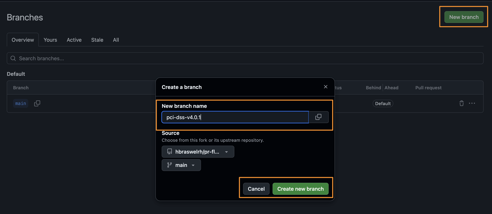
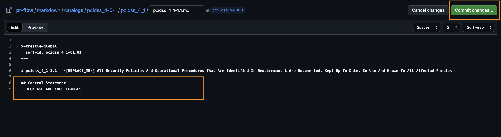
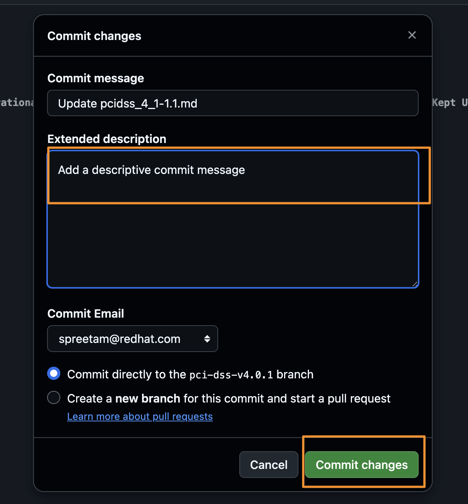
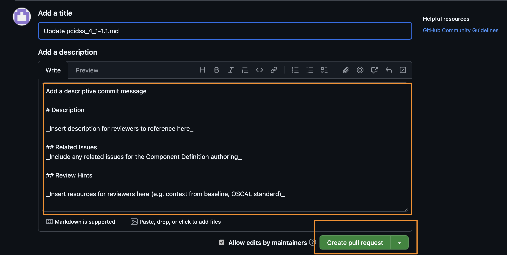
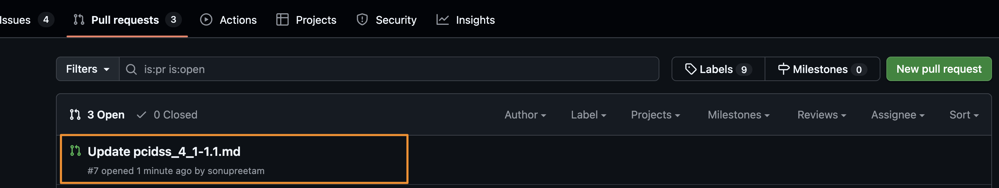

# pr-flow

This repo is a **hands-on sandbox** for practicing the full Pull Request flow:
1. create a branch, 2. propose changes via PR, 3. review, 4. merge.

## What you’ll do (check as you go)

- [ ] Read the branching refresher  
- [ ] Create branch example `pci-dss-v4.0.1`  
- [ ] Update Markdown for OSCAL Component Definitions  
- [ ] Commit with a descriptive message  
- [ ] Open a PR against `main`  
- [ ] Review a PR (approve or request changes)  
- [ ] Merge once approved

## Branching refresher

The `main` branch is the source of truth. The content merged to `main` must be reviewed and approved. 

> Read more about branching [here](https://docs.github.com/fr/pull-requests/collaborating-with-pull-requests/proposing-changes-to-your-work-with-pull-requests/about-branches)

### Create a new branch

#### Scenario 🗯️

The version of PCI DSS has recently been updated. The existing content in the `main` branch is out-of-date, but you need to update the content to reflect the latest version of PCI DSS.

#### Action

Create a new branch from `main` and name it `pci-dss-v4.0.1`. This new branch will have the existing content from `main`. 

Use this branch to update the existing content of `pci-dss-v3.2.1` (via Pull Request).

### Update the Markdown of an OSCAL Component Definition

Update the Markdown of Component Definitions for `pci-dss-v4.0.1` to reflect the latest version of PCI DSS.

Then, commit those changes to the new branch `pci-dss-v4.0.1`. Ensure that you use a descriptive commit message.

## Opening a PR 

To open a Pull Request, reference Step 2 of the [ComplyTime Skills Discovery GitHub course][creme-brulee]. The PR should be opened against the `main` branch and the changes will be shown as from the `pci-dss-v4.0.1` branch. The Pull Request body should include a description of the changes being proposed and any relevant documentation in the "Review Hints" section.

Then, click "Create Pull Request" to open the PR. The PR will be reviewed and either approved or rejected.

## Reviewing a PR 

### :tada: **Case 1:** The proposed content change _should_ be approved.

#### Scenario 🗯️

The version of PCI DSS has recently been updated. The existing content in the `main` branch is out-of-date, but you need to update the content to reflect the latest version of PCI DSS. The branch `pci-dss-v4.0.1` has been created and the changes have been proposed in a Pull Request.

The changes have correctly addressed the version change. The next step would be for the reviewer to submit a review with an explicit approval "LGTM."

#### When to Approve

Approve a PR when the proposed changes are accurate and ready to be merged into the main branch. A classic example is updating outdated information, such as revising a document to reflect the latest version of a standard, like PCI DSS.

#### Action

To approve, the reviewer(s) should select "Approve" in the review options and include a comment like "LGTM" (Looks Good To Me) to confirm the content is ready for merging.

#### Result

The PR will be merged once it receives the required number of approvals (e.g., two reviewers).

### ✖️**Case 2:** The proposed content change _should not_ be approved. Requesting changes on a Pull Request

#### Scenario 🗯️

The version of PCI DSS has recently been updated. The existing content in the `main` branch is out-of-date, but you need to update the content to reflect the latest version of PCI DSS. The branch `pci-dss-v4.0.1` has been created and the changes have been proposed in a Pull Request. The changes have inconsistencies, and there has been extra content included in the Pull Request. The next step would be to ask questions about the proposed changes to understand past the Pull Request body. Then, once clarifying the proposed changes, the user who opened the Pull Request will request a re-review.

#### When to Request Changes

Request changes when the content has inaccuracies, inconsistencies, or includes unnecessary information. This is the appropriate action for a PR that isn't ready to be merged.

#### Action 

Use the "Request Changes" feature in the PR review. This action alerts the author that revisions are needed. Additionally, you should leave comments directly on the PR to explain what needs to be fixed. Ask clarifying questions! It is better to understand the author's intent before suggesting changes.

#### Result

The author must address the feedback and then request a re-review by leaving a new comment on the PR. The PR cannot be merged until it receives the required approvals after the revisions have been made.

[creme-brulee]: https://github.com/complytime/creme-brulee
## Resources

* [creme-brulee]
* [OSCAL Content Repository](https://github.com/ComplianceAsCode/oscal-content)
* [Creating a Pull Request](https://docs.github.com/fr/pull-requests/collaborating-with-pull-requests/proposing-changes-to-your-work-with-pull-requests/creating-a-pull-request)