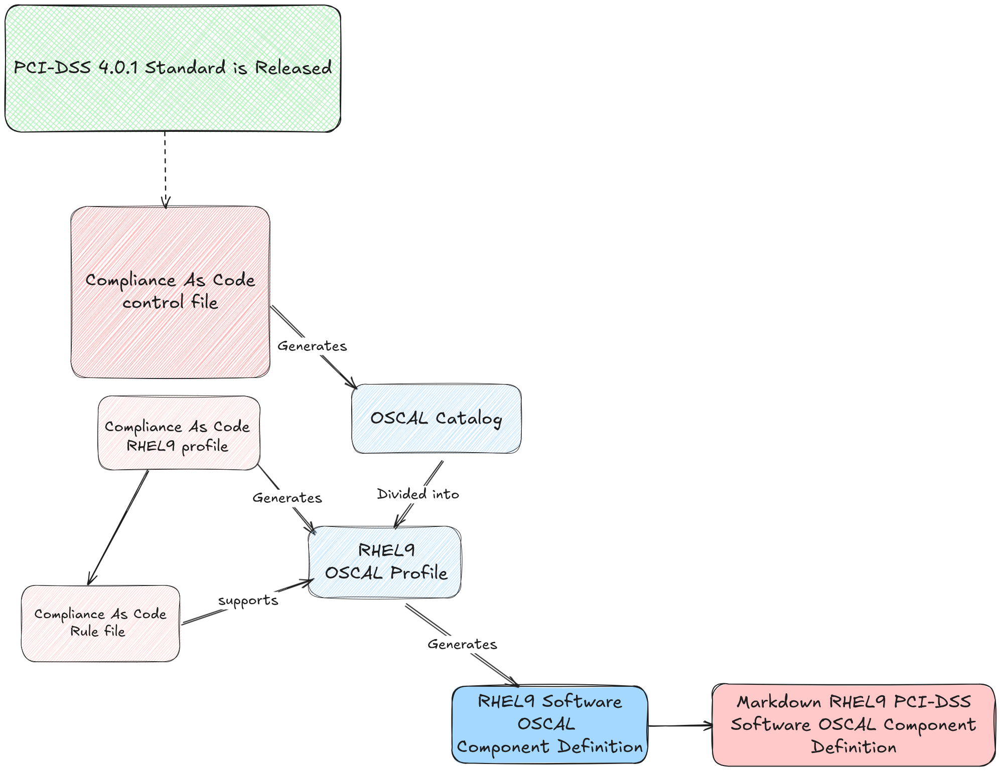
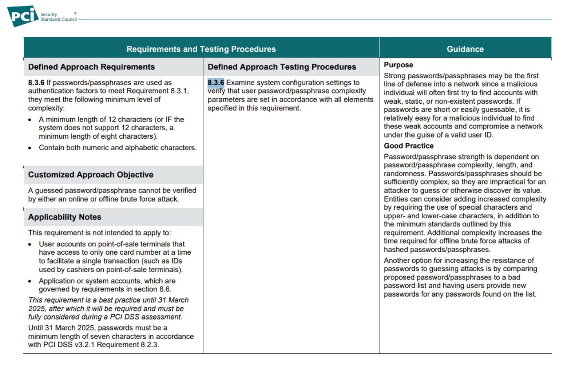
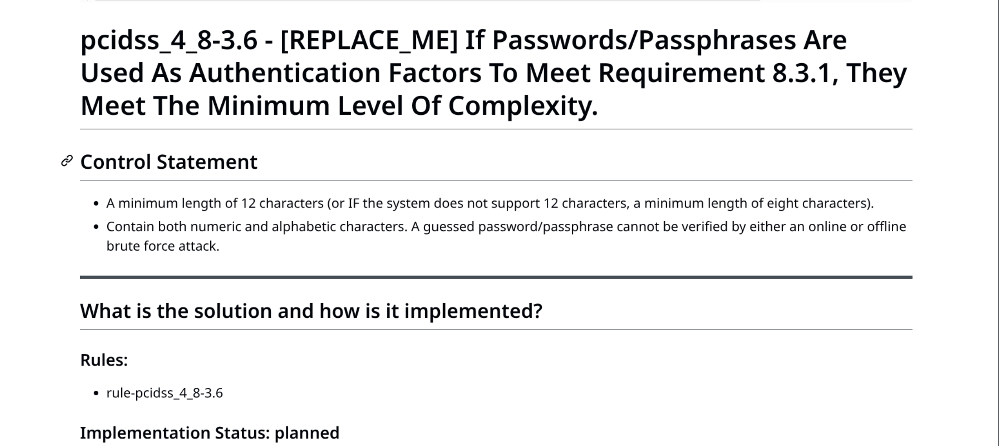
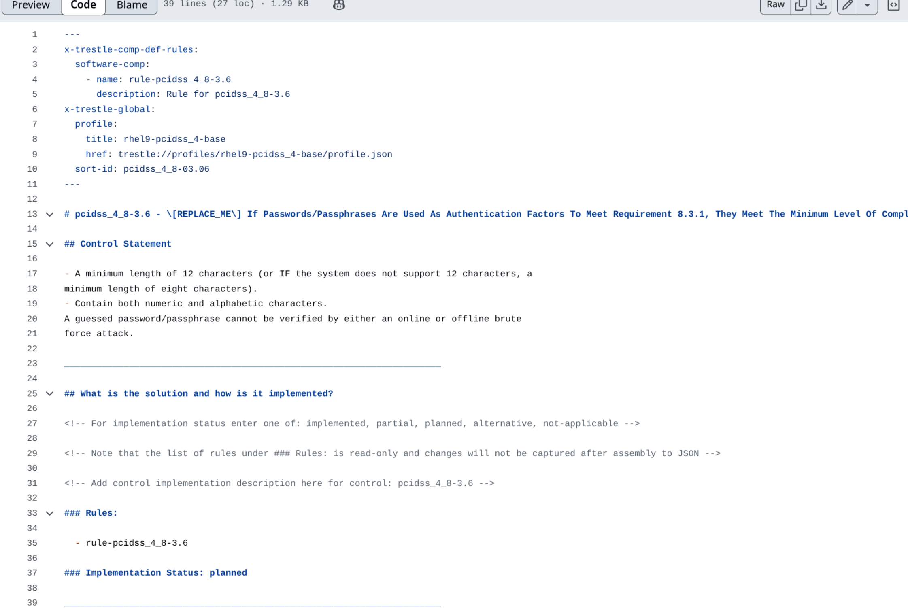

# Context for PCI-DSS Example 

_Follow the same guidelines for the other examples in this repository._



## Expectations

Authors and Reviewers should be familiar with the PCI-DSS requirements. Rules within the Component Definition are directly mapped to the PCI-DSS requirements.

If you are not familiar with the PCI-DSS requirements, please review the [PCI-DSS Requirements](https://www.commerce.uwo.ca/pdf/PCI-DSS-v4_0.pdf) and contact the Product Engineers to better understand the rules that map to certain criteria within PCI-DSS.

### Where to find the PCI-DSS Requirements _as Code_

Rules can be updated to reflect the latest PCI-DSS requirements. The Component Definition can be updated to reflect a change in title, description, or contextual information.

#### Control file

The control file includes all controls that will populate the OSCAL Catalog. 

[PCI-DSS 4.0.1](https://github.com/ComplianceAsCode/content/blob/master/controls/pcidss_4.yml)

[**Control - PCI-DSS 8.3:**](https://github.com/ComplianceAsCode/content/blob/f1dc8ab9d539bb140a389180c8e56a44b6a629d7/controls/pcidss_4.yml#L1992) Strong authentication for users and administrators is established and managed. 


#### Product-specific Profiles

* [RHEL8 PCI-DSS 4.0.1 Profile](https://github.com/ComplianceAsCode/content/blob/master/products/rhel8/profiles/pci-dss.profile)
* [RHEL9 PCI-DSS 4.0.1 Profile](https://github.com/ComplianceAsCode/content/blob/master/products/rhel9/profiles/pci-dss.profile)
* [RHEL10 PCI-DSS 4.0.1 Profile](https://github.com/ComplianceAsCode/content/blob/master/products/rhel10/profiles/pci-dss.profile)

#### Rules linked to the PCI-DSS Requirements

[**Requirement - 8.3.6:**](https://github.com/ComplianceAsCode/content/blob/f1dc8ab9d539bb140a389180c8e56a44b6a629d7/controls/pcidss_4.yml#L2081) If passwords/passphrases are used as authentication factors to meet Requirement 8.3.1, they meet the minimum level of complexity.

> **Rule supporting requirement 8.3.6:** [accounts_password_pam_minlen](https://github.com/ComplianceAsCode/content/blob/f1dc8ab9d539bb140a389180c8e56a44b6a629d7/linux_os/guide/system/accounts/accounts-pam/password_quality/password_quality_pwquality/accounts_password_pam_minlen/rule.yml#L4) - Ensure PAM Enforces Password Requirements - Minimum Length


## Where to find the Markdown Component Definition

[`./markdown/component-definitions/PCIDSS-Component/software-comp/rhel9-pcidss_4-base/pcidss_4_8/pcidss_4_8-3.6.md`](https://github.com/hbraswelrh/pr-flow/blob/main/markdown/component-definitions/PCIDSS-Component/software-comp/rhel9-pcidss_4-base/pcidss_4_8/pcidss_4_8-3.6.md)

#### PCI-DSS Requirement



PCI-DSS Req 8.3.6 [PDF](https://www.commerce.uwo.ca/pdf/PCI-DSS-v4_0.pdf)


#### Example ComplianceAsCode/content

The id `8.3.6` is referenced in the [ComplianceAsCode/content](https://github.com/ComplianceAsCode/content/blob/master/controls/pcidss_4.yml) control file for PCI-DSS. 

> **Note:** The `rules` (like `accounts_password_pam_dcredit`) are the same as the `Rule_Id` in the OSCAL Component Definition.


```yaml

 - id: 8.3.6
            title: If passwords/passphrases are used as authentication factors to meet Requirement 8.3.1,
                they meet the minimum level of complexity.
            description: |-
                - A minimum length of 12 characters (or IF the system does not support 12 characters, a
                minimum length of eight characters).
                - Contain both numeric and alphabetic characters.
                A guessed password/passphrase cannot be verified by either an online or offline brute
                force attack.
            levels:
                - base
            status: automated
            notes: |-
                This requirement is not intended to apply to:
                - User accounts on point-of-sale terminals that have access to only one card number at a
                time to facilitate a single transaction (such as IDs used by cashiers on point-of-sale
                terminals).
                - Application or system accounts, which are governed by requirements in section 8.6.
            rules:
                - var_password_pam_dcredit=1
                - var_password_pam_lcredit=1
                - var_password_pam_minlen=12
                - accounts_password_pam_dcredit
                - accounts_password_pam_lcredit
                - accounts_password_pam_minlen
                - cracklib_accounts_password_pam_dcredit
                - cracklib_accounts_password_pam_lcredit
                - cracklib_accounts_password_pam_minlen
            related_rules:
                - var_password_pam_ocredit=1
                - var_password_pam_ucredit=1
                - accounts_password_pam_ucredit
                - cracklib_accounts_password_pam_ocredit
                - cracklib_accounts_password_pam_ucredit


```

#### Example OSCAL Component Definition 

> The Component Definition includes `Rule_Id` fields that are the same as the `rules` in the `ComplianceAsCode/content` above.

```json
      {
                "uuid": "bbdcd591-aac1-4343-9d2b-3f8beb3a9437",
                "control-id": "pcidss_4_8-3.6",
                "description": "This requirement is not intended to apply to:\n- User accounts on point-of-sale terminals that have access to only one card number at a\ntime to facilitate a single transaction (such as IDs used by cashiers on point-of-sale\nterminals).\n- Application or system accounts, which are governed by requirements in section 8.6.",
                "props": [
                  {
                    "name": "implementation-status",
                    "ns": "https://oscal-compass.github.io/compliance-trestle/schemas/oscal/cd",
                    "value": "implemented"
                  },
                  {
                    "name": "Rule_Id",
                    "ns": "https://oscal-compass.github.io/compliance-trestle/schemas/oscal/cd",
                    "value": "accounts_password_pam_dcredit"
                  },
                  {
                    "name": "Rule_Id",
                    "ns": "https://oscal-compass.github.io/compliance-trestle/schemas/oscal/cd",
                    "value": "accounts_password_pam_lcredit"
                  },
                  {
                    "name": "Rule_Id",
                    "ns": "https://oscal-compass.github.io/compliance-trestle/schemas/oscal/cd",
                    "value": "accounts_password_pam_minlen"
                  }
                ]
              }

```

#### Rules in Markdown Component Definition

The Markdown Component Definition fields that can be updated are outlined in the "Code" view. 



#### Code View

Available fields to update include Control Statement, title, implementation status, and control implementation description. 

| Field                              | Description                                                                                           |
|------------------------------------|-------------------------------------------------------------------------------------------------------|
| Control Statement                  | The control statement is the context of the Component Definition.                                     |
| Title                              | The title of the Component Definition.                                                                |
| Implementation status              | The implementation status is the status of the Component Definition.                                  |
| Control Implementation Description | The control implementation description is used to update the control within the Component Definition. |



